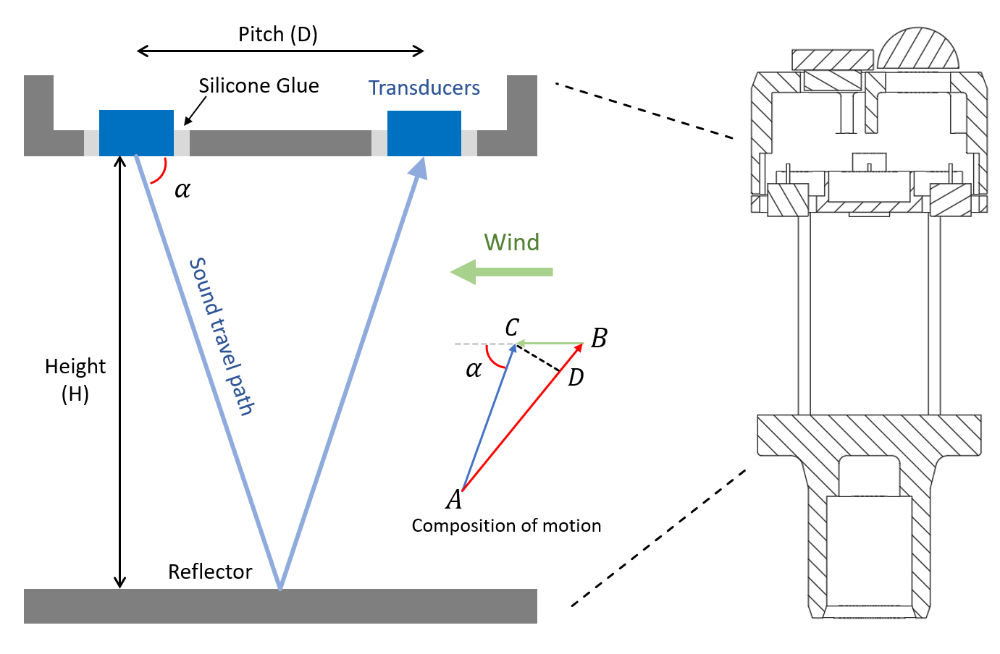
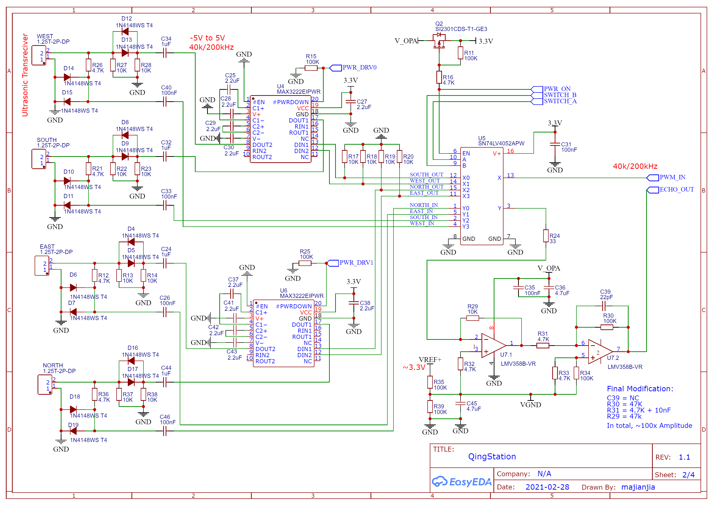
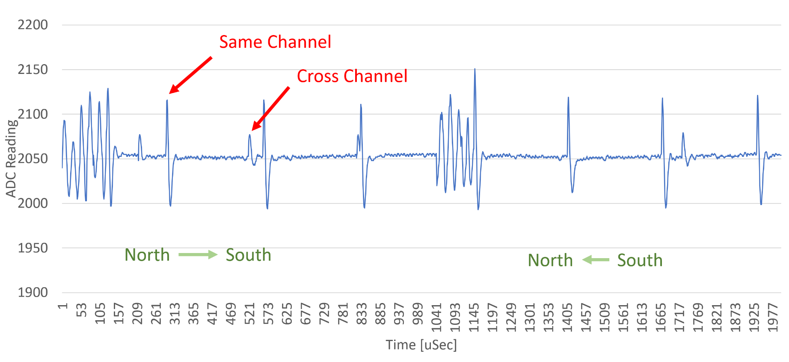

# Ultrasonic Anemometer Design and Practice

This documentation is dedicated to the ultrasonic anemometer design and tuning. 

# Introduction
Anemometer is the most interesting sensor on QingStation. 
However, it is also very challenging for me since I got almost no experience in analog circuit design, 
while anemometer require both analog amplifier and heavy data processing. 
(I don't even know how to use operational amplifier at the beginning).

A very good blog I learnt from time to time is this one [Anemometer by Hardy Lau](https://www.dl1glh.de/ultrasonic-anemometer.html#advancement). 
This log is very informative and already cover most of the knowledge needed to build your own ultrasonic anemometer. 

The principle in short: when ultrasonic waves (pules) propagate in a flowing medium(air), the time that the waves reach the destination will be different.
The time difference in forward and backward propagation is reflecting the speed of the medium flow, i.e. the wind speed. 
With 2 pairs of transducer placed perpendicular to each pair, the wind direction can also be calculated by using simple trigonometry.

The advantage of ultrasonic anemometer compared to other types:
- Ultrasonic anemometer is small compared to spinning type (cup anemometer).
- Reasonable difficulty and cheap to DIY, also a good instruction available by Hardy. 
- It has NO MOVING PARTS! Moving parts are not very easy to DIY especially when waterproofing. 

# Methods

## Basic principle

The principle is very simple, the sound wave that propagating in a medium (air) is affected by the movement of the medium. 
By using the known propagating path and the time of propagation, we can calculate the speed of medium. 

In the above graph, we can see the travel of wind *BC* added to the sound propagation *AB* result in the travel path *AC*.

[Lau](https://www.dl1glh.de/ultrasonic-anemometer.html#advancement) 
has posted all related equations (with different notation). 

In C language:
~~~
alpha = atan(2*H/D);
v = H/sin(alpha)*cos(alpha)*(1/t1 - 1/t2);// wind speed
c = H/sin(alpha)*(1/t1 + 1/t2);           // sound speed
~~~

To measure the wind direction, use `arctan2` on 2 perpendicular pairs.  
~~~
beta = atan2(NS, EW);  // north->south, east->west
~~~

## Practical issues, solution and compromise
In reality, things normally don't work as we want, especially with analog circuits. 

Here is the schematic of the second version(PCB v1.1), details will be explained in the following sections.

A low-voltage 4052 analog switch controls which channel is selected as output and which is listening to echo. 
Excitations are generated by timer's PWM channel, while the echo output is amplified by op amp and measured by ADC. 

### Ultrasonic transducer, driver 

#### Transducers
I brought a few different parts from taobao for testing, they are:
- A `40kHz` `10mm` waterproof(P/N: EU10AIF40H07T/R) 
- A `200kHz` `10mm` waterproof(P/N: EU10PIF200H07T/R)
- A `40kHz` `16mm` waterproof (P/N: NU40A16TR-1)
- A few HC-SR04 type open-end transducer. None-waterproof. 

The three with part number have similar parameters as below. 

- Transmition sound pressure `10V(0dB=0.02mPa) ≥106dB`
- Receive sensitive at `40KHz (0dB=V/ubar)：≥-75dB`
- Capacitive are all at a few `nF` depended on their diameter. 

I did not test the HC-SR04 because they are much larger than the `10mm` ones. 

The final decision is the first one, `40kHz 10mm` waterproof transducer(P/N: EU10AIF40H07T/R).
The size of it is small, which helps to reduce the overall assembly size. 
It is inexpensive compared to the `200k` (4 times the cost). 
High frequency can bring shorter pulse but thoes `40KHz` already good enough. 
It has a good spreading directivity(less than `-3dB @ 30degree`), which means that I didn't need to fix it at an angle to the plate.
Everythings lay down flat will be a big plus to mechanical design and assembly.

About frequency selection:
> Ideally, the pulses should as short as possible.
> We normally send `3~4` pulses.
>
> `f=40k, λ=8.4mm` pulse width `33mm` 
> 
> `f=200k, λ=1.68mm` pulse width `6.72mm` 
>
> Both are smaller than the Height (`5cm`). 
> Shorter wavelenght always better, however, signal signal also degrade faster through propagation.

The only concern left is whether the signal pules is short enough 
to avoid mix signal between the direct sound (we don't want) and reflective sound, i.e. echo (we need). 

I didn't consider the muRata `MA40E8-2` which was used in Lau's blog because the production was discontinued and it was more expensive anyway. 

#### Driver design
Driver design is a tricky part. A lot of pains here. 

For size and low-power consideration, I did not use a conventional mosfet driver + transformer to drive the transducer. 
Instead, like the old-style HC-SR04, I decided to use RS-232 interface drivers (such as MAX3232) to generate RS-232 levels 
(`-5.5V` for `1` and `+5.5V` for `0`) square wave. 
It should more or less provide at lease `10Vpp` signal to drive the transducer. 
Those 3V variances run on a 3V power supply so all the ICs and sensors can run on the single power rail. 

These RS-232 chips have many alternatives, the driving capability is good enough for the transducers (a few `kohm` and a `few nF` in parallel). 
The one used here is MAX3222, it provides a shutdown pin that can save power compared to more often used MAX3232. 
These chips are low-cost and packed in a small MSOP package. 

However, these chips introduced a huge interference issue from driver side.

The MAX3222 drive the transducer through a `1uF` capacitor from one of its output channel. 
On the receiver (transducer) side, a set of clamp diodes to ground and resistors should ensure the signal won't travel back to the driver side. 
Also, an other set of clamp diodes place in serial to the driver capacitor should block any noise that comes from the MAX3232. But it doesn't.

Because the MAX3232/3222 are generating negative and positive driving voltage based on charge pump method, 
it is impossible to get a smooth output voltage but can only decrease the frequency of switching by increasing those capacitors. 

The signal on the driving capacitor looks like this:

Although after the clamp diodes, the noise is "negligible" even my oscilloscope cannot detect, but somethings still pass there. 
Which results in a distortion of the receiving wave.  

Here is the wave without connecting transducer, when connected, the noise will be lower but still exist. 
The same channel means the driver (MAX3232) connected directly to the receiver. 
Cross channel means from the other MAX3232 by power or other unknown sources.

Below image shows an actual signal distorted by the noise from the driver side. 
The cross channel distortion is negligible, but the same channel distortion definitely affects the shape of the echo beam. 
Notice that the signal shown here was collect before I glue the transducer to the frame, so that the signal here have a larger amplitude.
When the transducers were glue to the frame, the distortion effect increased while the signal amplitude decreased.
This will leads to some trouble in measuring the arraving time.  

I tried many methods including adding capacity to the MAX3232 charge-pump capacitors. 
This helps to reduce the ripple frequency from `6.6kHz` to `~3kHz` but very little effect on reducing amplitude of the ripple. 

Later I found the trigger of the charging pump is very simple, once the voltage reaches a recharge threshold, it switches.
Very much like a DC/DC converter with PDM mode, low-power, but higher noise. This kind of noise cannot be eliminated.

In the first PCB (v1.0), I cannot eliminate this noise with MAX3232 because both MAX3232's power is controlled by one P-MOS.
So I designed a second PCB (v1.1) using MAX3222 which can be placed into a shutdown mode thus to stop the charge-pump. 
Hopefully, it can eliminate the issues. 

### Echo signal and amplifier

(I rarely touch analog circuit since forever, this definitely does not help)

When a transducer receive a signal, the echo signal first passes through a `4.7k` resistor then a `100nF` capacitor to block DC signal. 
Then, it passes through a analog switch (4052, Low Voltage variance), before it finally reaches the amplifier. 

Since we use a single rail power supply, the 4052 does not allow negative voltage signal to pass.
Instead, we will charge the `100nF` capacitor to the virtual ground (`1/2 Vreff`) 
before we start to send the pulses and collect measurement. 

#### Amplifiers

In the amplifier, I use the most common LMV358 dual op amp. 

In PCB v1.0, only a single-stage amplifier is used to amplify the echo, 
while the other one is used for generating a low impedance virtual ground. 

The op amp was only set to `10x`, which I cannot even see the signal in my ADC data. 
I overestimated the signal strength.
I later changed the gain to `~200x` to be able to record a clear signal. 
However, the signal reading ranges is still too small (around `100 digits/pp` in a `12bit, 4096` ADC). 

Later, until I accidently saw a tutorial on YouTube [Basics of Op Amp Gain Bandwidth Product and Slew Rate Limit](https://youtu.be/UooUGC7tNRg)
then I realized what was wrong here. The bandwidth of LMV358 (as well as all other op amps) list in datasheet is "Unit Gain" also equal to "Gain–Bandwidth Product" 
which does not cover the full frequency range. 
LMV358 will only have around maximum `1MHz/40kHz = 25x` gain no matter how much I set.  
What make things worst is I added a `22pF` capacitor to the feedback loop for a RC filter which also decrease the gain. 
The `22pF` is equal to `180kOhm` at `40kHz`. 
Now I see why I could not see a signal at the beginning, the final bandwidth is too small filtered out all signals. 

Unfortunately, by the time I learnt the GBP parameter, PCB V1.1 fabrication and assembly are already finished and on its long way to me. 
In PCB v1.1, the 2 op amps are all used to amplify the echo. 
The first stage was set to low input impedance, to help the signal to stable quicker when channel switch (charge the capacitor). 
The 2 stages op amps also allow higher total gains while still let the `40KHz` signal pass. 
The `22pF` was placed on the second stage op amp, which will need to be desolder when the boards arrive.  
The virtual ground is now provided by a voltage divider and a large capacitor. 
The new circuit looks good at lease in the simulation. 
However, in this circuit, we still cannot test the `200KHz` transducer, 
unless I change to a high bandwidth op amp and drop plenty of my LMV358 brought earlier.

#### The noise from the driver

I think the small capacitor in the clamp diodes let the driver's noise passed to the receiver side. 
This is also approved in a simulation circuit built using EasyEDA.
With clean power, I can still see a small amplitude noise pass through. 
The 1N4148 cannot block the noise from the driver side completely. 
That is why I changed the MAX3232 to MAX3222 in v1.1, the receiver's charge pump has to stop. 

### Signal processing

*The code for signal processing can be found in the dedicated firmware repository.*

#### ADC setting 

STM32L476's ADC is very powerful, can reach `5Msps`.
The ADC used to sample echo is configured to sample at `1MHz`. I did not configure it to higher because it is not necessary:
- LMV358 only have `1MHz` GBP.
- Sub resolution accuracy can be achieved by linear interpolation (details in signal processing section). 

At each burst, the ADC sample for `1ms`, which is exactly `1000` samples. 
It is enough for Height in the range of `4cm` to `10cm`

When does the first echo arrive, and how long does the ADC need to sample?
> Assemue Height(H)=`5cm`, Pitch(D)=`4cm`, Sound speed(C)=`336m/s`
>
> The distance that the sound travel is `S = sqrt((D/2)^2 + H^2) * 2 = 10.7cm`. 
>
> The first pulse arrives at around `t = 0.107 / 336 = 318us` after pulses sent when the wind is calm. 
> Even when H=`10cm` t=`588us`. `1000` samples is more than enough.

The resolution of ADC is set to `12bit`, the maximum raw resolution without any hardware oversampling. 

#### Preprocess

The signal output from the amplifier stage has been biased to `1/2 Vreff`, where Vreff is equal to MCU's Vdd `3.3V`.
So when there is no signal, the signal output should sit around `4095/2 = 2047.5`.
Since the op amp bandwidth is already low, no extra low-pass filter or oversampling is needed.

In the preprocessing stage, signals are brought back to zero and converted to floating-point. 

#### Echo pulse

In a non-coded excitation, the echo pulse is much longer than the excitation.

Here is the first echo recorded by my oscilloscope. The excitation length is `4` pulses. 

You could see that there are plenty of pulses instead of `4` which we sent. 
The envelope of the echo is very beautiful. We can use the shape to measure the rough propagating time. 
Or we can simply use the maximum magnitude to roughly measure it if the signal is not distorted as mentioned in driver sections. 

The accuracy of matching the signal can be as high as the resolution of time in the ADC sampling period, i.e. `1us @ 1Msps`.

This by now is the most unstable part because the inference from the driver affects the detection of the echo.
Result in sometimes this method will fail and the detection offset by one period, `25us`. 

#### Pulse compression
Pulse compression is very commonly implemented
If the above accuracy is not enough. I will implement a coded excitation using bark-code. 
It is fairly straight forward to perform a matched filter (pulse compression). 
But it requires much more CPU time since it is basically a signal correlation (same as a convolution in machine learning).
If it is needed, quantisation to `8/16bit` fixed-point then use Neural Network acceleration core will help the speed.

#### Zero-Crossing detection and interpolation
To further improve the resolution to sub digit of ADC sampling period, i.e. `<1us`, 
we can use an interpolated zero-crossing moment to increase the resolution.
This method is also suggested by [Lau's blog](https://www.dl1glh.de/ultrasonic-anemometer.html#advancement). 

This method requires a very stable zeroing of the raw signal which performed in the first step, preprocessing. 
These offset for each channel were calibrated during the power-up, by measuring and averaging the signal without sending excitation. 
It takes around `1` second.

Because all `4` channels shared the only `1` amplifier, they also share the minor bias if there is any so that will be cancelled out. 
The actual zero offsets of each channel are all at around `2047~2048`, very stable and accurate.  

Besides, during a calm wind, collect a set of zero-crossing as the baseline of zero wind speed. 

For each channel, the firmware interpolates `10` zero-crossing points around the maximum amplitude of each echo (easier to located).
Then it calculates the difference in time between the previous collected zero-crossing baseline in calm wind.
After that, the maximum `2` and minimum `2` time difference were excluded and the other left is averaged. 

This result in a pretty stable sub-digit accuracy, at least in calm wind. 
A simple test results in a standard error at `0.074us`, when converting to windspeed is `0.1m/s`.
This level of accuracy that a simple processing can provide is already very promising!

#### Extracting wind speed

Once the propagation time in all `4` channels, we can calculate the windspeed using the equations that 
[Lau](https://www.dl1glh.de/ultrasonic-anemometer.html#advancement) provided. 

The wind direction can also be inferred from the perpendicular pairs.

Besides, we can also extract the current calm wind speed directly instead of estimating it from atmospheric pressure and temperature. 

## Calibration

